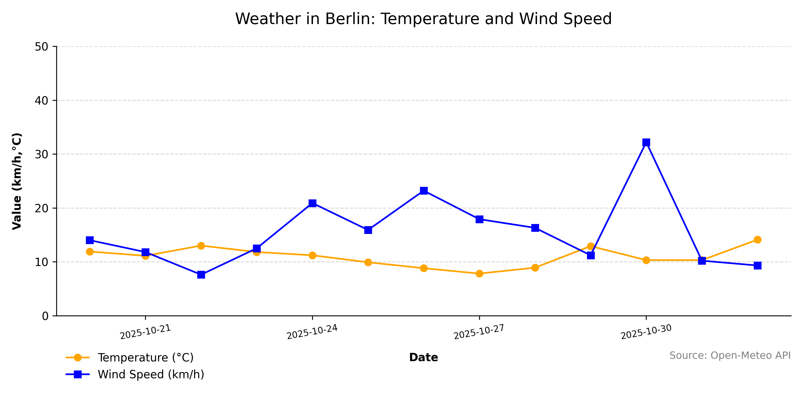
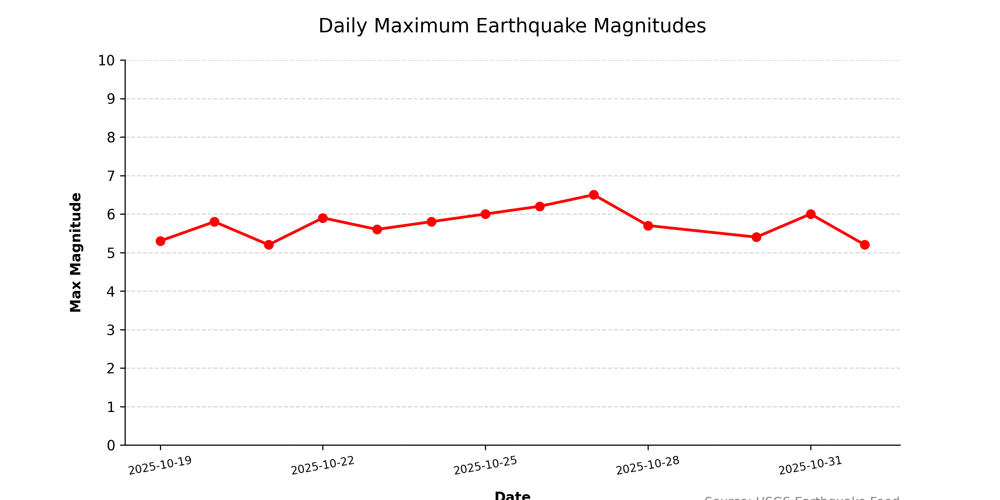

# 🌐 Multi-Source Data Scraper

This Python project automatically scrapes and stores daily data from multiple public sources:
- 💰 **Bitcoin price** from CoinGecko  
- 🌤️ **Weather data** from Open-Meteo  
- 🌍 **Earthquake alerts** from USGS

Data is saved in both **CSV** and **HDF5** formats. A scheduler runs the scraper daily during a 9-day window. Logs and visualizations are included.

---

## 📚 Table of Contents

- [✨ Features](#-features)
- [🏗️ Project Structure](#️-project-structure)
- [⚙️ Installation](#️-installation)
- [🚀 Usage](#-usage)
- [⏰ Automation](#-automation)
- [💾 Data Storage Format](#-data-storage-format)
- [🌐 Data Source Metadata](#-data-source-metadata)
- [⚖️ Legal & Ethical Compliance](#️-legal--ethical-compliance)
- [🗂 Data Structure Example](#-data-structure-example)
- [📊 Visualization](#-visualization)
- [🧩 Value Added Through Visualization](#-value-added-through-visualization)
- [📈 Sample Graphs](#-sample-graphs)
- [🧪 Testing & Validation](#-testing--validation)
- [❗ Known Limitations](#-known-limitations)
- [📦 Requirements](#-requirements)
- [🔭 Meta Perspective & Comparison with Best Practices](#-meta-perspective--comparison-with-best-practices)
- [📄 License](#-license)
- [📬 Contact](#-contact)

---

## ✨ Features

- ⏱️ **Automated daily scraping** at 11:00 AM (via `cron`).
- 💾 **Dual storage**: CSV + HDF5 with deduplication.
- 📊 **Clean and styled visualizations** with Matplotlib.
- 🧪 Modular, testable, and easy to expand.

---

## 🏗️ Project Structure
Below is the real folder structure of this project. This structure supports modular development, maintenance, and reproducibility.

```
scraping_project/
├── data/                # All collected data (CSV + main HDF5 storage)
├── logs/                # Logs from scrapers and scheduler
├── scrapers/            # Web scrapers for Bitcoin, weather, earthquakes
├── plotting/            # Scripts to visualize time-series data
├── scripts/             # Utility tools: backup, inspect, update HDF5, etc.
├── backups/             # Timestamped HDF5 dataset backups
├── storage.py           # Central HDF5 handling (read/write, deduplication)
├── scheduler.py         # Daily task manager (used with cron)
├── start_scheduler.sh   # Launch script for automation via cron
├── websites.csv         # Metadata of all scraped sources
├── requirements.txt     # Python dependencies
└── README.md            # Project documentation 

```

## ⚙️ Installation

#### 1.  The repo:
```
git clone https://github.com/your_username/scraping_project.git
cd scraping_project
```

#### 2. Create a virtual environment:
```
python3 -m venv .venv
source .venv/bin/activate
```

#### 3. Install dependencies:
```
pip install -r requirements.txt
```
## 🚀 Usage

Run the scraper manually:
```
python scrapers/scraper.py
```

Or run the visualization:
```
python plotting/plot_bitcoin.py
```
## ⏰ Automation

The project uses cron to:

* Start the scheduler at system reboot.
* Trigger scrapers daily at 11:00 AM.

#### Cron Configuration Example (macOS/Linux)
```
@reboot /absolute/path/to/start_scheduler.sh
0 11 * * * /absolute/path/to/start_scheduler.sh
```

Ensure:

* start_scheduler.sh is executable (chmod +x).
* The Python virtual environment path is correct.
* System is awake at 11:00 AM.

## 💾 Data Storage Format

The project uses both CSV and HDF5 for persistent storage.

### Why HDF5?

* 🔁 Fast reading/writing of large tables.
* 📅 Easy time-based filtering.
* 🔒 Deduplication by date.
* 🔗 Integrated with pandas.HDFStore.

#### HDF5 File Structure:

| Data Source      | HDF5 Key      | CSV File              |
| ---------------- | ------------- | --------------------- |
| CoinGecko BTC    | `bitcoin`     | `data/bitcoin.csv`    |
| Open-Meteo       | `weather`     | `data/open_meteo.csv` |
| USGS Earthquakes | `earthquakes` | `data/usgs.csv`       |


## 🌐 Data Source Metadata

The metadata for all web sources is stored in [`websites.csv`](./websites.csv), which includes:

- ✅ Website name
- ✅ URL
- ✅ Description
- ✅ Type of access (API or webpage)
- ✅ Notes on compliance and usage terms

This allows for easy replacement or expansion of data sources without changing the Python code.

## ⚖️ Legal & Ethical Compliance

All data sources used in this project were chosen based on their availability for **public and non-commercial academic use**. Below is a summary:

| Source       | Compliance Notes                                                                                   |
|--------------|----------------------------------------------------------------------------------------------------|
| CoinGecko    | Public API. Free for educational and non-commercial use. No authentication required. [Docs](https://www.coingecko.com/en/api/documentation) |
| Open-Meteo   | Open API with no key required. Designed for open access and academic use. [Docs](https://open-meteo.com/en/docs) |
| USGS         | U.S. Government data. Fully public and freely accessible. [Docs](https://earthquake.usgs.gov/data/comcat/documentation.php) |

The project ensures respectful access patterns:
- Limited to once-daily requests
- Uses official APIs when available
- Respects server limits and usage conditions

⚠️ No scraping of private, login-protected, or copyrighted content.


## 🗂 Data Structure Example

Example row from open_meteo.csv:

| date       | temperature | wind_speed | weather_code | source         |
| ---------- | ----------- | ---------- | ------------ | -------------- |
| 2025-10-27 | 7.8         | 17.9       | 61           | Open-Meteo API |

## 📊 Visualization

Once data is collected over multiple days, the following graphs are generated:

| Plot                    | Script                     |
| ----------------------- | -------------------------- |
| 📈 Bitcoin Price Trend  | `plotting/plot_bitcoin.py` |
| 🌡️ Temp/Wind in Berlin | `plotting/open_meteo.py`   |
| 🌍 Daily Earthquakes    | `plotting/plot_usgs.py`    |

Each chart includes:

* 📅 Date-based X-axis.
* 🏷️ Proper labeling and units (e.g., $, °C, magnitude).
* 🎯 Clean aesthetics and layout.
* 🔁 Fallback to .csv if HDF5 fails.

## 🧩 Value Added Through Visualization

Visualizing numeric trends over time provides actionable insights that static values do not.

Examples:
- 💰 **Bitcoin volatility** shows the potential impact on financial planning or investment strategies.
- 🌤️ **Weather changes** could influence logistics, events, or energy management.
- 🌍 **Earthquake frequency** offers early indications of potential seismic clusters.

The automated visualizations produced by this system allow decision-makers to monitor key variables over time, helping move from reactive to proactive decisions.

## 📈 Sample Graphs

### 💰 Bitcoin Price


### 🌤️ Berlin Weather (Temperature and Wind)



### 🌍 Earthquake Magnitudes



## 🧪 Testing & Validation

* Manual insertion of synthetic data for plotting.
* Tested fallback to CSV when HDF5 unavailable.
* Verified scheduler triggers scraping.
* Handled API downtime with retry logic.
* Verified deduplication in CSV and HDF5.

## ❗ Known Limitations

* 💡 System must be on (not sleeping) at 11:00 AM for cron to run.
* 🔌 Internet connection required for scraping APIs.
* 🧠 Requires periodic check of scheduler_state.txt.
* 🛠️ Scheduler state does not reset automatically after 9 days.

## 📦 Requirements

Install via:
```
pip install -r requirements.txt
```
#### Core Dependencies
```
beautifulsoup4==4.14.2
certifi==2025.10.5
charset-normalizer==3.4.4
contourpy==1.3.3
cycler==0.12.1
fonttools==4.60.1
h5py==3.15.1
idna==3.11
kiwisolver==1.4.9
matplotlib==3.10.7
numpy==2.3.4
packaging==25.0
pandas==2.3.3
pandas-stubs==2.3.2.250926
pillow==12.0.0
pyparsing==3.2.5
python-dateutil==2.9.0.post0
pytz==2025.2
requests==2.32.5
schedule==1.2.2
seaborn==0.13.2
six==1.17.0
soupsieve==2.8
typing_extensions==4.15.0
tzdata==2025.2
urllib3==2.5.0
```

## 🔭 Meta Perspective & Comparison with Best Practices

This project follows industry-standard practices for data scraping, automation, and storage:

| Practice Area         | Applied Approach in Project                                   |
|----------------------|---------------------------------------------------------------|
| Scraping strategy     | Uses public APIs (not fragile HTML parsing)                  |
| Modularity            | Separate files for scraping, storage, visualization           |
| Automation            | Cron-based scheduler for daily updates                        |
| Storage model         | HDF5 for time-series compatibility and deduplication         |
| Data structure        | Clean tabular format with typed fields                       |
| Validation            | Manual testing, fallback logic, and logging                  |

### 🧠 Academic & Industry Inspiration:

- **"Python Data Science Handbook"** by Jake VanderPlas – for best practices in pandas, storage, and visualization.
- Open projects like `covid-data-scraper`, `cryptowatch`, and academic dashboards.
- IU's own course materials on scraping, data cleaning, and time-series data management.

### 🎓 Conclusion

Compared to other academic or open-source scraping projects, this approach is robust, reproducible, and extensible. It demonstrates not just technical capability, but thoughtful architecture and data quality awareness—core pillars of Data Wrangling and Data Quality.

## 📄 License

This project was developed for the academic module:
\
Data Quality and Data Wrangling

Python and SQL Programming and Data Analysis
\
IU Internationale Hochschule Akademie

The code is intended strictly for educational use and assessment.
\
Unauthorized reproduction or redistribution is not permitted.

## 📬 Contact
Created by Diana Losch
🔗 GitHub: @dlosch9225